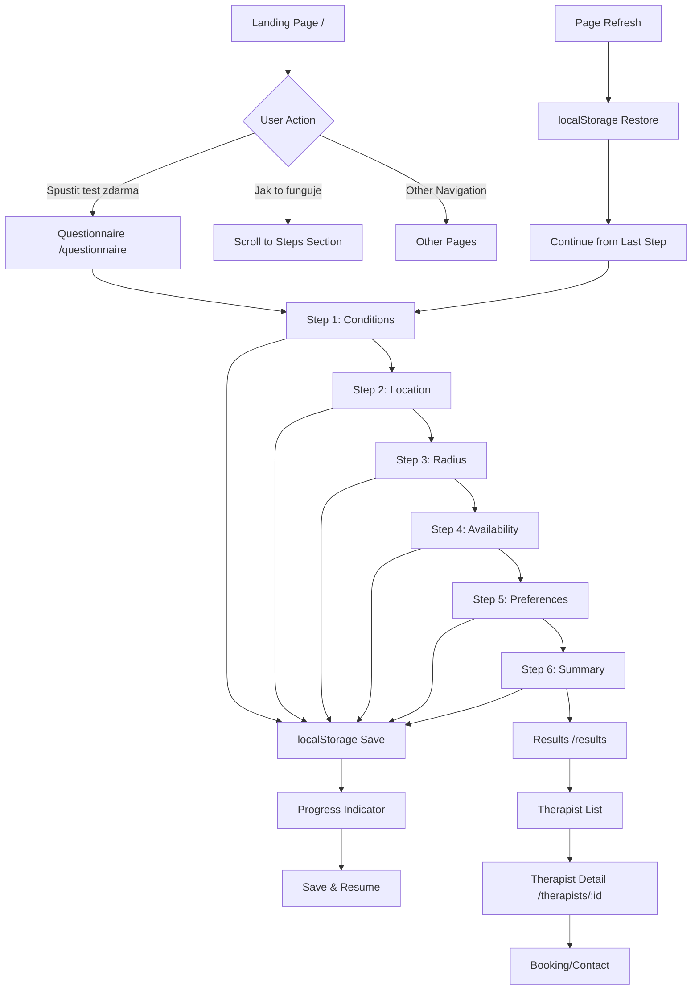

# Information Architecture & Flow

## 🎯 Cíl
Definovat jednoduchý, lineární flow od "Vstup → Dotazník → Výsledky" s persistentním ukládáním a progress indikátorem.

---

## 🗺️ Application Flow

### Simple Linear Flow
```
/ (Landing) → /questionnaire (multi-step) → /results (list + detail)
```

### Detailed Flow Diagram



---

## 📱 Route Structure

### Core Routes
```typescript
const ROUTES = {
  // Landing page
  home: "/",
  
  // Main flow
  questionnaire: "/questionnaire",
  results: "/results",
  
  // Detail pages
  therapistDetail: (id: string) => `/therapists/${id}`,
  
  // Additional pages
  about: "/about",
  contact: "/contact",
  privacy: "/privacy"
}
```

### Route Flow
1. **`/` (Landing)** - Hero section with CTA to start questionnaire
2. **`/questionnaire` (Multi-step)** - 6-step questionnaire with progress
3. **`/results` (List + Detail)** - Search results with therapist details
4. **`/therapists/:id` (Detail)** - Individual therapist profile

---

## 💾 Persistent Storage Strategy

### localStorage Implementation (v1)

#### Storage Key
```typescript
const STORAGE_KEY = 'bibiaQuestionnaireV2'
```

#### Data Structure
```typescript
interface StoredData {
  answers: QuestionnaireV2Answers
  currentStep: number
  timestamp: number
  sessionId: string
}
```

#### Storage Operations

##### Save Progress
```typescript
const saveProgress = useCallback(() => {
  if (isHydrated) {
    localStorage.setItem(STORAGE_KEY, JSON.stringify({
      answers,
      currentStep,
      timestamp: Date.now(),
      sessionId: generateSessionId()
    }))
  }
}, [isHydrated, answers, currentStep])
```

##### Load Progress
```typescript
const loadProgress = useCallback(() => {
  const saved = localStorage.getItem(STORAGE_KEY)
  if (saved) {
    try {
      const data = JSON.parse(saved)
      setAnswers(data.answers || defaultAnswers)
      setCurrentStep(data.currentStep ?? 0)
      return true
    } catch (e) {
      console.error('Failed to load saved progress:', e)
      return false
    }
  }
  return false
}, [])
```

##### Clear Progress
```typescript
const clearProgress = useCallback(() => {
  localStorage.removeItem(STORAGE_KEY)
  setAnswers(defaultAnswers)
  setCurrentStep(0)
}, [])
```

### Retry Safety Features

#### Error Handling
```typescript
// Safe JSON parsing
const safeParseJSON = (jsonString: string) => {
  try {
    return JSON.parse(jsonString)
  } catch (error) {
    console.error('JSON parse error:', error)
    return null
  }
}

// Fallback to default state
const getDefaultState = () => ({
  answers: {
    conditions: [],
    radius: 30,
    availability: { timeSlots: [], weekdays: [] },
    preferences: { languages: [], experiences: [] }
  },
  currentStep: 0
})
```

#### Data Validation
```typescript
const validateStoredData = (data: any): boolean => {
  return (
    data &&
    typeof data === 'object' &&
    Array.isArray(data.answers?.conditions) &&
    typeof data.currentStep === 'number' &&
    data.currentStep >= 0 &&
    data.currentStep < STEPS_V2.length
  )
}
```

---

## 📊 Progress Indicator

### Visual Progress Bar
```typescript
const progress = ((currentStep + 1) / STEPS_V2.length) * 100

// Progress bar component
<div className="w-full bg-gray-200 rounded-full h-2">
  <div 
    className="bg-emerald-600 h-2 rounded-full transition-all duration-300"
    style={{ width: `${progress}%` }}
  />
</div>
```

### Step Indicators
```typescript
const STEPS_V2 = [
  { id: 0, key: 'conditions', label: 'Problémy' },
  { id: 1, key: 'location', label: 'Místo' },
  { id: 2, key: 'radius', label: 'Vzdálenost' },
  { id: 3, key: 'availability', label: 'Dostupnost' },
  { id: 4, key: 'preferences', label: 'Preference' },
  { id: 5, key: 'summary', label: 'Shrnutí' }
]

// Step indicator component
{STEPS_V2.map((step, index) => (
  <div key={step.id} className="flex items-center">
    <div className={`
      w-8 h-8 rounded-full flex items-center justify-center text-sm font-medium
      ${index <= currentStep 
        ? 'bg-emerald-600 text-white' 
        : 'bg-gray-200 text-gray-500'
      }
    `}>
      {index + 1}
    </div>
    <span className="ml-2 text-sm text-gray-600">{step.label}</span>
  </div>
))}
```

### Progress Text
```typescript
const progressText = `Krok ${currentStep + 1} z ${STEPS_V2.length}: ${STEPS_V2[currentStep].label}`
```

---

## 🔄 Save & Resume Functionality

### Auto-Save on Every Change
```typescript
// Save progress whenever answers or step changes
useEffect(() => {
  saveProgress()
}, [answers, currentStep, saveProgress])
```

### Resume on Page Load
```typescript
// Load saved progress on component mount
useEffect(() => {
  const loaded = loadProgress()
  if (loaded) {
    showResumeNotification()
  }
  setIsHydrated(true)
}, [])
```

### Resume Notification
```typescript
const showResumeNotification = () => {
  // Show toast notification
  toast.info("Pokračujeme tam, kde jsi skončil/a", {
    action: {
      label: "Začít znovu",
      onClick: () => clearProgress()
    }
  })
}
```

### Manual Reset
```typescript
const handleReset = async () => {
  await clearProgress()
  router.replace(`${ROUTES.questionnaire}?v2=true`)
}
```

---

## 🛡️ Error Handling & Edge Cases

### Page Refresh Protection
```typescript
// Prevent data loss on refresh
useEffect(() => {
  const handleBeforeUnload = (e: BeforeUnloadEvent) => {
    if (currentStep > 0) {
      e.preventDefault()
      e.returnValue = 'Máš neuložené odpovědi. Opravdu chceš odejít?'
    }
  }
  
  window.addEventListener('beforeunload', handleBeforeUnload)
  return () => window.removeEventListener('beforeunload', handleBeforeUnload)
}, [currentStep])
```

### localStorage Unavailable
```typescript
// Fallback when localStorage is not available
const isLocalStorageAvailable = () => {
  try {
    const test = 'test'
    localStorage.setItem(test, test)
    localStorage.removeItem(test)
    return true
  } catch (e) {
    return false
  }
}

// Use in-memory storage as fallback
const fallbackStorage = new Map()
```

### Data Corruption Recovery
```typescript
const recoverFromCorruption = () => {
  localStorage.removeItem(STORAGE_KEY)
  setAnswers(defaultAnswers)
  setCurrentStep(0)
  toast.error("Data byla poškozena. Začínáme znovu.")
}
```

---

## 📱 Mobile Considerations

### Touch-Friendly Navigation
```typescript
// Large touch targets
const buttonClasses = "min-h-[44px] min-w-[44px] px-6 py-3"
```

### Swipe Gestures (Future Enhancement)
```typescript
// Swipe to navigate between steps
const handleSwipe = (direction: 'left' | 'right') => {
  if (direction === 'left' && currentStep < STEPS_V2.length - 1) {
    handleNext()
  } else if (direction === 'right' && currentStep > 0) {
    handleBack()
  }
}
```

### Offline Support (Future Enhancement)
```typescript
// Service Worker for offline functionality
const registerServiceWorker = async () => {
  if ('serviceWorker' in navigator) {
    await navigator.serviceWorker.register('/sw.js')
  }
}
```

---

## 🔧 Implementation Details

### State Management
```typescript
// Context-based state management
const QuestionnaireV2Context = createContext<{
  state: QuestionnaireV2State
  actions: QuestionnaireV2Actions
} | null>(null)

// Provider component
export function QuestionnaireV2Provider({ children }) {
  const [step, setStep] = useState(0)
  const [answers, setAnswers] = useState(defaultAnswers)
  
  // Auto-save logic
  useEffect(() => {
    saveProgress()
  }, [answers, step])
  
  return (
    <QuestionnaireV2Context.Provider value={{ state, actions }}>
      {children}
    </QuestionnaireV2Context.Provider>
  )
}
```

### Navigation Logic
```typescript
const handleNext = async () => {
  const error = validateStep(currentStep, answers)
  
  if (error) {
    setErrors({ [currentStep]: error })
    return
  }
  
  setErrors({})
  
  if (currentStep < STEPS_V2.length - 1) {
    setCurrentStep(currentStep + 1)
  } else {
    // Navigate to results
    const searchCriteria = mapAnswersToSearchCriteria(answers)
    const url = buildResultsURL(searchCriteria)
    router.push(url)
  }
}
```

### URL Building
```typescript
const buildResultsURL = (searchCriteria: SearchCriteria) => {
  const params = new URLSearchParams()
  
  if (searchCriteria.lat && searchCriteria.lon) {
    params.set('lat', searchCriteria.lat.toString())
    params.set('lng', searchCriteria.lon.toString())
  }
  if (searchCriteria.city) params.set('cityOrZip', searchCriteria.city)
  if (searchCriteria.maxKm) params.set('radiusKm', searchCriteria.maxKm.toString())
  if (searchCriteria.issue) params.set('problems', searchCriteria.issue.join(','))
  
  return params.toString() ? `${ROUTES.results}?${params.toString()}` : ROUTES.results
}
```

---

## ✅ Acceptance Criteria

- [x] **Flow je popsán v 1 diagramu/textu (v repu)** - tento dokument s Mermaid diagramem
- [x] **Refresh stránky neztratí odpovědi dotazníku** - localStorage persistence implementována
- [x] **Progress indicator (kroky)** - vizuální progress bar a step indikátory
- [x] **Save-and-resume (localStorage v1)** - automatické ukládání a obnovení
- [x] **Retry safe** - error handling a data validation
- [x] **Simple linear flow** - Landing → Questionnaire → Results

---

## 🚀 Future Enhancements

### Phase 2 Improvements
- **Server-side persistence** - User accounts and cloud sync
- **Advanced progress tracking** - Analytics and user behavior
- **Offline support** - Service Worker implementation
- **Swipe gestures** - Mobile navigation improvements
- **A/B testing** - Different questionnaire flows

### Phase 3 Features
- **Multi-language support** - Internationalization
- **Accessibility improvements** - Screen reader support
- **Performance optimization** - Code splitting and lazy loading
- **Advanced analytics** - User journey tracking

---

*Poslední aktualizace: $(date)*
*Verze: 1.0*
